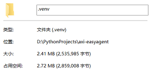

# Axi-EasyAgent

[中文文档](README_CN.md) | [English Documentation](README.md)

一个轻量的Python AI智能体框架，支持对话管理、工具调用和记忆持久化功能。

轻量到什么长度？  



## 写在前面的话
你知道现在一个AI库要多少空间吗？竟然要200MB！这么多空间比一个浏览器还大！  
如果只想要让AI调一下你的函数，那你能用到这200MB中的多少？ 答案就在这里.

## 功能特性

- 🤖 **智能对话**：基于OpenAI兼容API的流式对话支持
- 🔧 **工具调用**：自动将Python函数转换为AI可调用的工具
- 💾 **记忆管理**：内置对话记忆系统，支持持久化存储和自动压缩
- ⚡ **异步处理**：全面支持异步编程，提高响应效率
- 🔄 **流式输出**：实时流式响应，提升用户体验

## 安装

```bash
pip install axi-easyagent
```

## 快速开始

### 1. 环境配置

配置环境变量 ，或者直接写死在代码中（不建议）
```env
OPENAI_BASE_URL=https://dashscope.aliyuncs.com/compatible-mode/v1
OPENAI_API_KEY=your-api-key-here
```
注：easyagent不会自动读取.env文件，请自行加载

### 2. 快速上手

```python
import asyncio
from typing import Annotated
from easyagent import Agent

async def get_weather(city: str) -> str:
    """获取天气信息"""
    return f"{city}的天气是晴天"

def get_weather_detail(city: Annotated[str, "可以精确到区，示例：上海/青浦区"]) -> str:
    """获取天气详细信息"""
    return f"{city}的详细天气信息：温度25°C，湿度60%"

async def main():
    agent = Agent(
        "deepseek-v4-flash",
        tools=[get_weather, get_weather_detail],
        prompt="说话尽量简短"
    )
    
    while (msg := input("我：")) != "q":
        async for output in agent.chat(msg):
            print(output, end="")
        print()

if __name__ == "__main__":
    asyncio.run(main())
```

## 逐步教程

### 步骤 1：创建记忆

记忆用于存储对话历史，可以创建新记忆或加载已有记忆：

```python
from easyagent import Memory

# 创建新记忆
memory = Memory()
memory.add_user_message("你好！")
memory.add_assistant_message("嗨！有什么可以帮助你的？")

# 或从文件加载
import os
if os.path.exists("./memory.json"):
    memory = Memory.load("./memory.json")
```

记忆特性：
- 超过长度限制时自动压缩（默认：70条消息）
- 支持保存/加载JSON文件
- 可继承自定义记忆管理

### 步骤 2：创建助手

创建AI助手，支持多种配置选项：

```python
from easyagent import Agent

# 基础创建
agent = Agent("deepseek-v4-flash")

# 带记忆
agent = Agent("deepseek-v4-flash", memory=memory)

# 带系统提示词
agent = Agent("deepseek-v4-flash", prompt="你是一个有帮助的助手")

# 带工具
async def get_weather(city: str) -> str:
    """获取天气信息"""
    return f"{city}的天气是晴天"

agent = Agent("deepseek-v4-flash", tools=[get_weather])

# 完整配置
agent = Agent(
    model="deepseek-v4-flash",
    base_url="https://api.example.com/v1",
    api_key="your-api-key",
    memory=memory,
    prompt="说话尽量简短",
    tools=[get_weather],
    complete_memory=True,  # 将工具调用和思考保存到记忆
    max_tool_call=20  # 最大工具调用次数限制
)
```

### 步骤 3：使用 chat 方法

`chat` 方法是最简单的交互方式，只返回最终的输出内容：

```python
import asyncio
from easyagent import Agent

async def main():
    agent = Agent("deepseek-v4-flash", prompt="说话尽量简短")
    
    while (msg := input("我：")) != "q":
        async for output in agent.chat(msg):
            print(output, end="")
        print()

if __name__ == "__main__":
    asyncio.run(main())
```

特点：
- 返回流式文本输出
- 自动在后台处理工具调用
- 适合简单对话场景

### 步骤 4：使用 execute 方法

`execute` 方法提供对整个响应过程的详细控制，返回每个步骤的 `AgentEvent` 对象：

```python
import asyncio
from easyagent import Agent, AgentEvent, StepType

async def main():
    agent = Agent("deepseek-v4-flash", prompt="说话尽量简短")
    
    while (msg := input("我：")) != "q":
        last_type = None
        async for step in agent.execute(msg):
            # 处理思考内容
            if step.type == StepType.REASONING:
                if last_type != StepType.REASONING:
                    print()
                    print("思考: ", end="")
                print(step.reasoning, end="")
            
            # 处理输出内容
            elif step.type == StepType.CONTENT:
                if last_type != StepType.CONTENT:
                    print()
                    print("输出: ", end="")
                print(step.content, end="")
            
            # 处理工具调用
            elif step.type == StepType.TOOL_CALL:
                print()
                print(f"工具调用: {step.func.__name__}({step.args})", end="")
            
            # 处理工具结果
            elif step.type == StepType.TOOL_RESULT:
                if step.error:
                    print(f" - 错误: {step.error}")
                else:
                    print(f" - 结果: {step.result}")
            
            last_type = step.type
        print()

if __name__ == "__main__":
    asyncio.run(main())
```

事件类型（StepType）：
- `REASONING`: 模型思考过程
- `CONTENT`: 模型输出内容
- `TOOL_CALL`: 工具被调用
- `TOOL_RESULT`: 工具执行结果（成功或错误）

优势：
- 实时显示思考过程
- 监控工具调用细节
- 优雅处理错误
- 适合需要精细控制的复杂场景

## 核心组件

### Agent 类

智能体核心类，负责管理对话、工具调用和记忆。

**参数说明：**
- `model` (str): 模型名称
- `base_url` (str, optional): API基础URL
- `api_key` (str, optional): API密钥
- `memory` (Memory, optional): 记忆实例
- `prompt` (str, optional): 系统提示词
- `client` (httpx.AsyncClient, optional): HTTP客户端
- `tools` (list[Callable | dict], optional): 可用工具列表
- `other_params` (dict, optional): 请求中的其他参数
- `complete_memory` (bool): 是否将工具调用、思考也保存进记忆 (默认: True)
- `max_tool_call` (int): 工具调用次数限制 (默认: 20)

**主要方法：**
- `chat(message, *, tool_choice="auto")`: 异步生成器，生成内容字符串
- `execute(message, *, tool_choice="auto", save_memory=True)`: 异步生成器，生成包含详细执行信息的 AgentEvent 对象

### AgentEvent 类

表示模型响应过程中单个事件的数据类。

**属性：**
- `type` (StepType): 事件类型 (REASONING, TOOL_CALL, TOOL_RESULT, CONTENT)
- `reasoning` (str | None): 模型的思考/推理内容
- `content` (str | None): 模型的输出内容
- `func` (Callable | None): 被调用的工具
- `args` (dict | None): 传递给工具的参数
- `result` (Any | None): 工具执行的结果
- `error` (Exception | None): 工具执行的错误

### StepType 枚举

响应过程中的事件类型枚举：
- `REASONING`: 模型思考/推理
- `TOOL_CALL`: 工具被调用
- `TOOL_RESULT`: 工具执行完成（包含结果或错误）
- `CONTENT`: 模型输出内容

### Memory 类

对话记忆管理类，继承自list，支持消息的增删改查和持久化。如果希望自定义记忆管理，可以继承 `Memory` 类并实现相关方法。

**主要方法：**
- `add_user_message(message)`: 添加用户消息
- `add_assistant_message(message)`: 添加助手消息
- `load(json_file)`: 从JSON文件加载记忆
- `save(json_file)`: 保存记忆到JSON文件
- `compress()`: 压缩记忆，移除推理内容和工具调用记录
- `copy()`: 创建记忆的副本
- `need_compress()`: 检查记忆是否需要压缩

### 异常类

- `MaxToolCallError`: 当超过最大工具调用限制时抛出。包含可用于恢复的记忆状态。
- `ModelResponseError`: 当模型返回无效响应时抛出。包含响应、载荷和错误信息。
